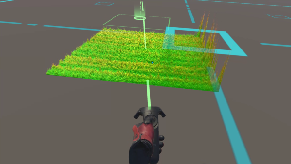
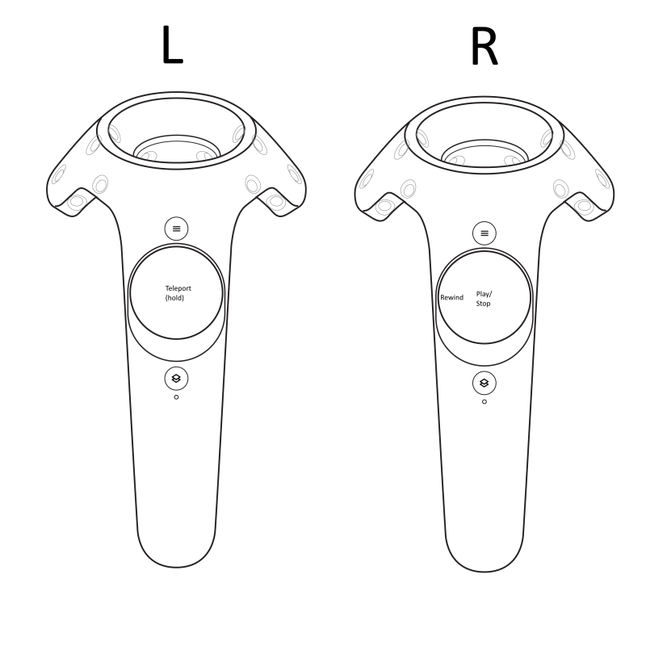

# VrUnitySpectrum

VrUnitySpectrum is a student project for the Hochschule für Musik Karlsruhe to visualize FFT spectrum data in VR.

Author: Manuel-Philippe Hergenröder

---

### Requirements
  - Unity Version 2019.2.10f1
  - Steam with [SteamVR](https://store.steampowered.com/app/250820/SteamVR/) installed

---

### Bundled external libraries
 - [NAudio](https://github.com/naudio/NAudio) - NAudio is an open source .NET audio library written by Mark Heath
 - [FFTW](http://www.fftw.org/) - FFTW is a C subroutine library for computing the discrete Fourier transform

---

### Getting started

#### In Unity
Just hit play.

When stopped you can change the input audio file via the inspector of the "Audio"-GameObject in the "Audio Engine"-Component.

#### With the standalone player
After launching _VrUnitySpectrum.exe_ there will be a filechooser. You can select an audio file - see "Examples" to load one of the bundled files.

#### Controls
Use both of htc VIVE controllers for navigation and playback:

Without a Head-Mounted-Display you can just hit Play in Unity and navigate with WASD and change the camera with your mouse (while holding down right-mouse-button)
You can start/stop playback on the keyboard with _space_, press _backspace_ to rewind.

You can exit the program with _ALT+F4_.

### Misc
Currently only mono audio files with 8, 16, 24, 32 or 64 bits per sample are supported. For now I've only tested WAV PCM files with sampling rates 44.1kHz, 48 kHz and 96 kHz. NAudio should also be able to read in: AIFF, MP3 (using ACM, DMO or MFT), G.711 mu-law and a-law, ADPCM, G.722, WMA, AAC, MP4 and more others with Media Foundation (untested).